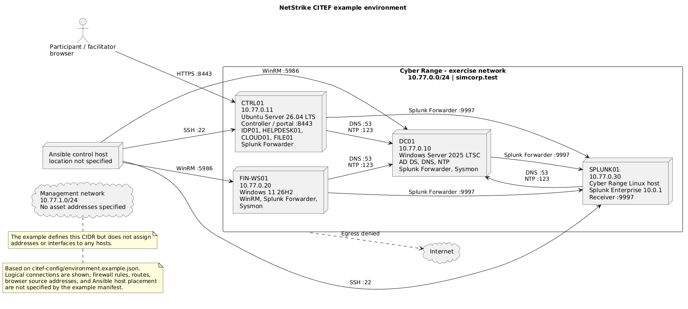

# CITEF topology and readiness workflow

**Owner:** Patrick Luu  
**Status:** Proposed design; not approved for CITEF deployment  
**Tracking:** [#103](https://github.com/Netstrike-development-team/NetStrike_Capstone_17/issues/103), [#79](https://github.com/Netstrike-development-team/NetStrike_Capstone_17/issues/79)

This package defines a reproducible logical topology and the gate to run after
Cyber Range snapshot restoration. It intentionally does not invent live CITEF
addresses, image versions, or access credentials. The range has confirmed
on October 2, 2026 that the team may create any required amd64 VM, Windows 11,
Windows Server, and multiple Linux distributions are available, DNS/NTP must
be configured by the team through Ansible, and scenario VMs have no Internet
access. Earlier range decisions also confirmed offline file transfer, Splunk
Enterprise, and clean snapshots. The planning baseline now selects Ubuntu
Server 26.04 LTS, Windows Server 2025 LTSC, and Windows 11 26H2, with a
proposed configurable RFC1918 address plan below. These are team assumptions,
not CITEF allocations or approval. Verify image availability/builds and
network overlap with the range before deployment. The local manifest
intentionally validates configuration and egress evidence, not CITEF
approval; record approval separately in the CITEF decision record before
deployment.

## Proposed logical topology



The diagram illustrates the proposed logical connections and planning
addresses. It does not define firewall rules, routes, browser source
addresses, Ansible control-host placement, or management-network interfaces;
confirm those with CITEF before deployment.

Keep `DC01`, `FIN-WS01`, and `SPLUNK01` on separate VMs. The initial
zero-cost layout places project-owned Linux services on `CTRL01`; `FILE01` is
a controller-managed logical fixture store on `CTRL01`, outside participant
and attack-module administration. If the range has capacity and approves it,
`FILE01` can instead be a separate Linux VM. Never consolidate the controller,
domain controller, participant endpoint, or Splunk.

| Logical asset | Proposed placement | Trust boundary and purpose |
|---|---|---|
| `CTRL01` | Ubuntu Server 26.04 LTS amd64; proposed `10.77.0.11` | Facilitator-controlled controller, portal, event ledger, action adapters, mock IdP/helpdesk/cloud services |
| `DC01` | Windows Server 2025 LTSC amd64; proposed `10.77.0.10` | Synthetic SimCorp AD and directory evidence; proposed internal DNS/NTP source |
| `FIN-WS01` | Windows 11 26H2 amd64; proposed `10.77.0.20` | Participant investigation endpoint and endpoint telemetry |
| `SPLUNK01` | Cyber Range-supported host running Splunk Enterprise 10.0.1; proposed `10.77.0.30` | SIEM, saved searches, and source health; 10 GB maximum daily ingestion and 300 GB disk limit confirmed |
| `FILE01` | Logical service on `CTRL01`; optional dedicated Linux VM | Disposable synthetic fixtures and controller-managed known-good copy |

### Planning image and address assumptions

As of October 2, 2026, the candidate releases are:

| VM | Planning image | Current vendor release evidence |
|---|---|---|
| `CTRL01` | Ubuntu Server 26.04 LTS amd64 | [Ubuntu release list](https://wiki.ubuntu.com/Releases) identifies 26.04 (Resolute Raccoon) as the latest release |
| `DC01` | Windows Server 2025 LTSC amd64 | [Microsoft Windows Server release information](https://learn.microsoft.com/en-us/windows/release-health/windows-server-release-info) identifies Windows Server 2025 as current LTSC |
| `FIN-WS01` | Windows 11 26H2 amd64 | [Microsoft Windows 11 release information](https://learn.microsoft.com/en-us/windows/release-health/windows11-release-information) lists 26H2 as the latest generally available feature release |

At image acquisition, record the exact image identifier, edition, architecture,
build/update level, and SHA-256. Microsoft lists Windows 11 26H2 build
26300.9550 and Windows Server 2025 build 26100.33451 as the latest revisions
on September 29 and September 14, 2026, respectively. Stage any required
updates and package artifacts before transfer: exercise VMs cannot fetch
updates or packages from the Internet. Verify the final Ansible collections
and Splunk version support the chosen OS releases. In particular, do not
assume the Cyber Range's Splunk host can be changed to Ubuntu 26.04.

The proposed exercise subnet is `10.77.0.0/24`; `10.77.1.0/24` is reserved
as a separate management subnet. The sample static exercise addresses and
internal service plan are:

| Asset | Proposed exercise IP | Proposed internal DNS name |
|---|---|---|
| `DC01` | `10.77.0.10` | `dc01.simcorp.test` |
| `CTRL01` | `10.77.0.11` | `ctrl01.simcorp.test` |
| `FIN-WS01` | `10.77.0.20` | `fin-ws01.simcorp.test` |
| `SPLUNK01` | `10.77.0.30` | `splunk01.simcorp.test` |

Configure the `simcorp.test` DNS zone on `DC01`; point scenario VMs at
`10.77.0.10` for DNS. Configure `DC01` as the isolated exercise time source
and the AD PDC emulator; point Linux and non-domain services at its NTP
service, and configure domain members to use the domain time hierarchy.
`DC01` has no public upstream in the isolated exercise network. Validate
forward and reverse name resolution and measured clock skew before snapshot
capture. These addresses/domain are repository planning assumptions only:
check that the ranges do not overlap with the Cyber Range management network
and record the assigned values in the approved local manifest before
generating inventory.

Participant and simulated-action access is limited to `FIN-WS01` and explicitly
allowlisted service paths. The Ansible control channel, controller, Splunk
administration, hypervisor, and snapshot controls are staff-only. Use the
Cyber Range-approved isolated network and management path; do not introduce a
bridged/NAT Internet path. The actual subnet and firewall rules must come from
CITEF, not this repository.

## Range-owner decisions required before deployment

Confirm and record the following with Zian/Julien, coordinating dates and
delivery with Latifa:

| Decision | Required evidence |
|---|---|
| VM mapping and compute | Exact amd64 image/version, vCPU, RAM, disk, owner, and snapshot-capable asset ID for each physical host |
| Addresses and DNS | Approved non-overlapping exercise/management CIDRs, static host addresses, FQDNs, DNS server addresses, and records resolving each host to its approved address |
| Time | Approved NTP source, service/configuration on each VM, and accepted maximum clock skew |
| Firewall and access | Written default-deny Internet policy; participant, controller, Splunk, SSH, and WinRM paths/ports; management reachability during endpoint isolation |
| Identity | Approved exercise domain, baseline synthetic accounts and group memberships, AD administration path, and reset behavior |
| Telemetry | Splunk product/version and capacity are recorded above; still confirm URL, source/index conventions, required data-source probes, role boundaries, and credential injection method |
| Offline delivery | Reviewed bundle version/hash, approved transfer route, host-side checksum verification, and licensed installer approvals |
| Safety response | Named emergency-stop operator, tested staff contact channel, egress-policy verifier, failed-restore escalation path, and evidence-retention requirement |
| Snapshot ownership | Operator and immutable snapshot/image identifier for every physical host; restore steps and escalation owner |

The environment questionnaire in
[`../docs/exercise-design/06-citef-requirements-and-approval.md`](../docs/exercise-design/06-citef-requirements-and-approval.md)
remains the decision record. A proposed value is not an approved value.

The team owns Ansible configuration of DNS and NTP; this is not a Cyber Range
service dependency. Select an approved internal DNS domain/host and NTP
endpoint, then configure and validate them on every VM. Scenario VMs have no
Internet access, so package installation, time synchronization, name
resolution, and telemetry must not depend on public endpoints. Choose Linux
images whose supported network/time services can be configured by the pinned
Ansible roles, or add and test the matching distribution-specific role before
the image is approved.

## Approved manifest and generated inventory

Copy `environment.example.json` to the ignored local file
`environment.json`, then fill it only with approved, non-secret configuration.
Do not commit the copy. The JSON Schema (`environment.schema.json`) enforces required fields, types,
allowed properties and values, date/URL/IP formats, and digest shapes. The
small cross-field layer in `validate_environment.py` checks network overlap
and membership, host/logical-asset mappings, DNS/domain relationships,
artifact bundle layout, and endpoint/port consistency. Both validation and
inventory rendering run these gates. Validation enforces:

- disjoint RFC 1918 management/exercise networks and deny-by-default egress;
- unique, in-subnet target IPs and fully qualified host names;
- dedicated controller, domain-controller, workstation, and Splunk hosts;
- `FILE01` on `CTRL01` or a separate Linux host;
- required service checks, exact identity baseline, fixture hashes, and
  run-correlated Splunk probes;
- per-host clean snapshot IDs, restore ownership, emergency-stop verification;
  and
- no credential or secret fields in the manifest.

Validate the manifest and render an Ansible inventory only after it is
complete:

```sh
python3 citef-config/validate_environment.py validate \
  --config citef-config/environment.json
python3 citef-config/validate_environment.py inventory \
  --config citef-config/environment.json \
  > citef-config/inventory.ini
```

`validate_environment.py` requires `jsonschema`, declared in
`citef-config/requirements-validator.txt` and also in
`shared/requirements.txt`, which the current workflow includes. Confirm the
wheel is present in the built bundle before deployment. On the Ansible control
host, install it from the wheelhouse before running Ansible, using the same
Python interpreter that will run the validator:

```sh
python3 -m pip install --no-index \
  --find-links offline-bundles/CITEF-RELEASE/netstrike-offline-bundle/destinations/CTRL01/wheelhouse \
  -r citef-config/requirements-validator.txt
```

The generated inventory is ignored by Git and contains only approved host
addresses and connection settings. It contains no account names, passwords,
tokens, or private keys. Inject SSH/WinRM credentials using the approved local
Ansible Vault or Cyber Range secret-injection mechanism; never put them in the
manifest, command history, or repository. Inject
`NETSTRIKE_READINESS_TOKEN` and `SPLUNK_TOKEN` into the Ansible process
environment through the approved secret manager.
Each Splunk probe query must include `{run_id}` and return its configured
`expected_event_id` field/value so the check proves both source freshness and
correlation for the new run.

The checked-in example intentionally fails validation because its range-owned
configuration and egress verification fields are incomplete. No inventory can
be rendered from it. CITEF approval is an operational prerequisite recorded in
the requirements/decision record; it is not duplicated as a manifest field.
The example and test addresses are not CITEF assignments.

## Offline provisioning and controller deployment

The manually triggered `Build offline bundle` workflow publishes a
hash-verified Python runtime and wheelhouse for the requirements listed in the
workflow. It does not publish project source, the complete controller
requirements, Ansible, or Ansible collections. A source archive assembled
from a reviewed checkout of the matching repository revision, along with any
missing locked controller dependencies, must be staged and verified
separately before deployment; the current workflow is not a complete CITEF
release bundle. See the
[Python bundle guide](../docs/offline-bundle.md) for its exact contents and
installation steps. Stage the runtime bundle, verified source archive,
collections, and approved Universal Forwarder, Sysmon, Splunk receiver CA,
controller TLS certificate, and controller TLS CA under the directory named
by `offline_artifacts.directory`. The example manifest's artifact paths are
deliberately blank and must be replaced with the staged relative paths and
SHA-256 digests.

Download the pinned Ansible collections and dependencies on a connected
staging machine, transfer the tarballs through the approved offline path, and
install them on the Ansible control host without Galaxy access:

```sh
ansible-galaxy collection download \
  -r citef-config/requirements.yml \
  -p citef-config/collection-bundle
ansible-galaxy collection install \
  --offline \
  citef-config/collection-bundle/*.tar.gz \
  -p citef-config/collections
```

Run `ansible-playbook` from `citef-config/` so its pinned `ansible.cfg`,
collections, roles, and ignored `environment.json` are used. The provisioning
gate verifies every declared artifact hash and the Python bundle's
`SHA256SUMS` before any range host changes. The controller role extracts the
release into a deployment-specific directory, installs the runtime without network
access, and starts a restricted systemd service as the unprivileged
`netstrike` account. It extracts source into an immutable, content-addressed
release directory, binds only to CTRL01's approved inventory address, serves
HTTPS using the staged certificate, and checks that the injected private key
matches that certificate.

Inject `controller_service_tokens` (a JSON-compatible mapping from token to
`actor_id`/`role`), `controller_readiness_token` (a facilitator token),
`controller_identity_audit_key` (at least 32 characters), and
`controller_tls_private_key_pem` through the approved Ansible Vault or secret
manager. The controller TLS CA must be trusted by clients and the Ansible
control host. The local provisioning check requires the application to be
ready to prepare; a clean snapshot is captured only after approved facilitator
preparation and the full external readiness gates pass.

Provision approved VMs from `citef-config/` with:

```sh
ansible-playbook \
  -i inventory.ini \
  playbooks/provision.yml \
  --extra-vars "deployment_id=UNIQUE_DEPLOYMENT_ID"
```

Do not use the checked-in sample values or attempt provisioning until the
manifest, images, transfer artifacts, TLS materials, secrets, and CITEF
approvals have been populated and independently reviewed. Live provisioning
and restore-cycle acceptance still require the actual range.

The Splunk Universal Forwarder roles currently collect Windows security,
PowerShell, and Sysmon logs plus Linux syslog/auth logs. The portal's structured
exercise-event ledger remains in its local SQLite database; normalized
application-event forwarding to Splunk is not implemented yet. Do not declare
an application-event Splunk source ready until that integration and its
run-correlated query are added and tested.

## Post-restore readiness

Use clean snapshots as the reset mechanism. Ansible validates the restored
environment; any approved idempotent correction is a separate, versioned
provisioning action. Ansible does not recreate VMs, control the hypervisor,
modify snapshots, or promise a timed reset.

### Initial baseline and snapshot capture

The first clean baseline is a separate, one-time deployment activity:

1. Verify the candidate amd64 images/releases and proposed private subnets
   with the range owners. Record the exact image/build, assigned addresses,
   access protocols, and offline bundle approval.
2. Configure the approved VMs using the versioned offline deployment
   automation, synthetic identity manifest, telemetry configuration, and
   fixture hashes. Do not use Internet package repositories or include
   licensed installers/secrets in Git.
3. Run the same service, identity, fixture, clock, application, and Splunk
   checks used by the readiness procedure. Confirm egress denial and emergency
   stop with the range operator. Any failure blocks snapshot capture.
4. Ask the named snapshot owner to capture the clean VM snapshots only after
   the checks pass. Record each immutable snapshot/image ID in the local
   manifest and record evidence of the passing baseline.
5. Restore those snapshots and pass readiness once before accepting them as
   the delivery baseline.

The repository includes offline Ansible provisioning roles for the proposed
Ubuntu/Windows images, DNS/NTP, AD/DNS baseline, Universal Forwarder/Sysmon,
and controller portal. The roles are syntax-checked but have not been tested
against actual CITEF images. Do not treat them as hypervisor/snapshot controls
or claim range acceptance until live image tests and restore cycles pass.

1. Stop the scenario; close/archive its run evidence; verify no registered
   action or prior-run process remains. Keep prior evidence intact.
2. The named range operator restores every physical VM from its recorded clean
   snapshot ID. If any restore fails, stop and escalate to Zian/Julien; do not
   admit participants or attempt an unapproved partial reset.
3. Transfer the reviewed offline bundle. Verify its manifest and SHA-256 on
   each destination before installing or applying configuration.
4. Generate a new, unique run ID and emit one harmless, identifiable
   readiness event from each required source. Do not reuse a previous run ID.
5. Inject runtime credentials through the approved mechanism and run:

   ```sh
   ansible-playbook \
     -i citef-config/inventory.ini \
     citef-config/playbooks/readiness.yml \
     --extra-vars "exercise_run_id=NEW_UNIQUE_RUN_ID"
   ```

   The playbook checks connectivity, OS mapping, internal DNS answers, clock
   skew, required OS services, AD domain/users/group membership, fixture
   SHA-256 hashes, local application/event-ledger readiness, and each
   run-correlated Splunk source probe. It is read-only apart from those
   explicitly emitted test events. Secret-bearing API calls suppress task
   output.
6. A staff operator separately confirms the egress deny rule and tests
   emergency-stop reachability on the approved non-delivery test run. The
   manifest attestation records the operator, time, and contact channel; it
   does not trigger the stop or claim to independently prove firewall state.
7. Record all host snapshot IDs, readiness output, test-event IDs, bundle
   digest, operator, and outcome in the cycle record below. The facilitator
   signs the readiness record before participant admission.
8. Repeat restore plus readiness until three consecutive cycles reproduce the
   documented baseline. Any failed check blocks admission, is recorded, and
   must be corrected before restarting the three-cycle acceptance sequence.

The controller's `/api/facilitator/readiness` endpoint remains a local
application check only. A passing local report cannot replace the Ansible
checks, Splunk source queries, human egress/emergency-stop verification,
snapshot-restore evidence, or facilitator admission signature.

## Three-cycle acceptance record

Complete this table with actual evidence; do not mark a cycle passed from a
planned or simulated result.

| Cycle | Date/operator | Snapshot IDs / bundle digest | New run ID and telemetry probe IDs | Ansible result / blockers | Egress + emergency-stop operator evidence | Facilitator sign-off |
|---|---|---|---|---|---|---|
| 1 | Pending | Pending | Pending | Pending | Pending | Pending |
| 2 | Pending | Pending | Pending | Pending | Pending | Pending |
| 3 | Pending | Pending | Pending | Pending | Pending | Pending |

The repository currently has no approved CITEF manifest or recorded CITEF
restore cycle. This is a proposed implementation and acceptance procedure,
not evidence that #103's external deployment criteria have passed.

## Local checks

The schema validator uses `jsonschema` from
`citef-config/requirements-validator.txt`; the cross-field checks use the
Python standard library. Install the requirement as described above, then run
the checks without range access:

```sh
python3 -m unittest discover -s citef-config/tests -v
```

Ansible syntax and live-target checks require the approved offline Ansible
runtime/collections and a complete local manifest. Do not validate by
connecting to guessed or example addresses.
