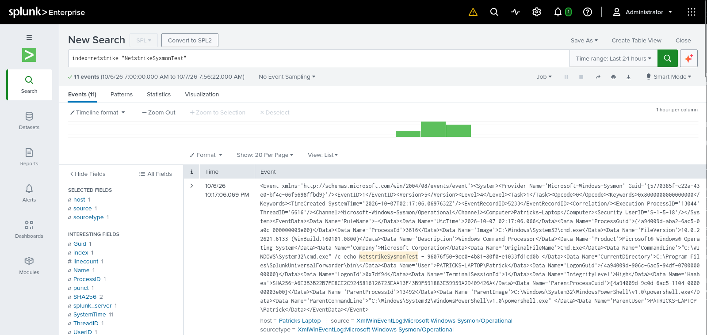

# Offline tool bundle inventory and deployment decisions

**Status (2026-10-07):** The merged CI workflow builds and verifies a
versioned CTRL01 bundle containing the portable Python runtime, resolved wheels,
project source trees, and pinned Ansible collections. `inventory.json` records
per-artifact version, source, license, owner, SHA-256, destination VM, and offline
installation method. A CI bundle is not Cyber Range deployment acceptance:
compatible target images, and clean network-isolated VM evidence remain separate
gates. Patrick reports that the Ubuntu offline application smoke test and Windows
Sysmon-to-Splunk ingestion test succeeded; remaining acceptance checks are listed
in the test record below.

This document is the consolidated source for:

- offline bundle scope and artifact inventory;
- tool and approval decisions for the exercise;
- installation and readiness expectations for offline deployment; and
- the current gaps that still need verification before release.

It supersedes the earlier 07 planning notes and should be used alongside
[06-citef-requirements-and-approval.md](06-citef-requirements-and-approval.md)
and the [CITEF configuration guide](../../citef-config/README.md).

## Decision and approval gates

| Item | Current status | Evidence required to close |
|---|---|---|
| Splunk Enterprise and capacity | CITEF-provided Splunk Enterprise 10.0.1 under the Cyber Range educational license; maximum 10 GB ingestion per day and 300 GB disk | Confirmed 2026-10-02. CITEF permits HEC and Universal Forwarder ingestion and a dedicated `netstrike` index with one-day retention; participant investigation and facilitator simulation-management access must be separated (relayed 2026-10-04). Patrick reports approximately 2 MB for 5,000 events over two hours; one-day retention and RBAC are being configured under [#102](https://github.com/Netstrike-development-team/NetStrike_Capstone_17/issues/102) |
| Windows telemetry and forwarding | Selected Splunk Universal Forwarder 10.0.1 and Sysmon 15.22 | Patrick reports both staged archives matched the recorded hashes, and Sysmon events arrived in the `netstrike` index from Windows 11 26H2 (build 26300.9550, AMD64); screenshot evidence is linked in the test record. No additional licensing or transfer review is considered applicable per Patrick |
| Controller, portal, and state | Python 3.11, FastAPI, SQLite; the bundle includes the declared dashboard, validator, controller, shared, and module wheels | Build inventory records exact wheel/runtime versions, license/author metadata, checksums, CTRL01 destination, and offline install method |
| Ansible and remote configuration | `ansible-core` requirement `>=2.16,<3`; `ansible.windows` 3.8.0 and `microsoft.ad` 1.12.1 | Patrick reports all VMs were successfully deployed using Ansible and the collection checksum passed |
| Snapshot restoration and readiness | All VMs were successfully deployed using Ansible | Snapshot design, restoration, and readiness workflow are tracked under [#103](https://github.com/Netstrike-development-team/NetStrike_Capstone_17/issues/103) |
| Commercial EDR | Not included in the MVP | Sysmon and Windows logs provide endpoint evidence; restricted NetStrike exercise controls simulate limited containment actions and must be described as exercise controls, not production EDR |
| Mock cloud and impact | Project-owned stateful Python mock; safe marker files and reversible file moves | Keep the mock local; limit changes to allowlisted disposable fixtures; do not add real cloud APIs or encryption |
| Scenario VM architecture and images | Ubuntu Server 26.04.1 for the Linux controller/portal smoke test; Windows 11 26H2 build 26300.9550 AMD64 for Windows telemetry | Patrick identified these as the selected target images; record sizing/destination roles and validate provisioning/readiness and snapshot restoration |
| DNS and NTP | Team can configure these through Ansible | Select an internal DNS domain and time source; implement and validate configuration |
| Offline artifact delivery | Scenario VMs have no Internet; the team can push files to them | Stage dependencies, installers, configuration, and transfer workflow; record checksum verification before deployment |
| Student-funded software | No paid software or public-cloud services are required from the student team | Use the Cyber Range-provided Splunk educational license and free/open-source or project-owned components; verify evaluation terms |
| Project runtime package lock and wheelhouse | Generated by the CI workflow for each bundle revision | Review generated `inventory.json` and `requirements.lock`; exact wheel versions and hashes are recorded per build |
| Ansible collections and other system installers | `citef-config/requirements.yml` pins `ansible.windows` and `microsoft.ad`; controller requirements and collection archives are bundled | The bundle records versions, metadata, SHA-256, CTRL01 destination, and offline install method; approved system installers remain separately staged |
| Portal network independence | Dashboard and dependencies installed and ran on Ubuntu Server 26.04.1 AMD64 with the Ethernet interface disabled | The offline install/run is the acceptance test for this issue; a separate external-request audit is not required |
| Clean offline installation | Ubuntu Server 26.04.1 AMD64 dashboard install tested with the Ethernet interface disabled; all VMs subsequently deployed using Ansible per Patrick | Preserve the test record below and complete outstanding readiness and snapshot-restore checks on the selected target images |
| Versioned release bundle | CI builds a versioned runtime/source/collection bundle; the offline test record identifies the tested source commit and workflow artifact | Selecting or identifying a later release candidate is outside this issue; release assembly and transfer planning remain separate deployment work |
| Artifact licensing and transfer | Patrick reports no additional licensing or transfer review is applicable to the tested artifacts/use | Treat as the project owner's stated disposition for this acceptance record; keep proprietary installers, secrets, and credentials out of Git |

The generated inventory is authoritative for exact package versions and hashes
in each build. I checked the wheel metadata in the tested bundle's workflow
artifact (commit `5553a3f`) and resolved fields that its first inventory left
unknown: license expressions/classifiers and bundled license files establish
licenses; wheel author/maintainer fields and their email display names establish
the listed upstream authors/maintainers. For Ansible collections, the manifest
lists authors, while each collection archive's `COPYING` file contains GNU GPL
version 3 text. The names below reflect published author/maintainer metadata,
not an independent determination of legal copyright ownership.

| Bundle artifact | License | Upstream author/maintainer metadata |
|---|---|---|
| `annotated-doc` 0.0.5 | MIT | Sebastián Ramírez |
| `annotated-types` 0.8.0 | MIT | Adrian Garcia Badaracco; Samuel Colvin; Zac Hatfield-Dodds |
| `ansible-core` 2.19.13 | GPL-3.0-or-later | Ansible Project |
| `anyio` 4.15.1 | MIT | Alex Grönholm |
| `arrow` 1.4.0 | Apache-2.0 | Chris Smith |
| `attrs` 26.1.0 | MIT | Hynek Schlawack |
| `blinker` 1.9.0 | MIT | Jason Kirtland |
| `charset-normalizer` 3.5.2 | MIT | Ahmed R. TAHRI |
| `click` 8.5.0 | BSD-3-Clause | Pallets |
| `cryptography` 50.0.2 | Apache-2.0 OR BSD-3-Clause | The Python Cryptographic Authority and individual contributors |
| `fastapi` 0.142.2 | MIT | Sebastián Ramírez |
| `Flask` 3.1.3 | BSD-3-Clause | Pallets |
| `fqdn` 1.6.0 | MPL-2.0 | ypcrts |
| `httpcore` 1.0.9 | BSD-3-Clause | Tom Christie |
| `httptools` 0.8.0 | MIT | Yury Selivanov |
| `httpx` 0.28.1 | BSD-3-Clause | Tom Christie |
| `idna` 3.20 | BSD-3-Clause | Kim Davies |
| `isoduration` 20.11.0 | ISC | Víctor Muñoz |
| `itsdangerous` 2.2.0 | BSD-3-Clause | Pallets |
| `Jinja2` 3.1.6 | BSD-3-Clause | Pallets |
| `jsonschema` 4.26.0 | MIT | Julian Berman |
| `jsonschema-specifications` 2025.9.1 | MIT | Julian Berman |
| `MarkupSafe` 3.0.4 | BSD-3-Clause | Pallets |
| `opentelemetry-api` 1.45.0 | Apache-2.0 | OpenTelemetry Authors |
| `packaging` 26.3 | Apache-2.0 OR BSD-2-Clause | Donald Stufft |
| `pycparser` 3.0 | BSD-3-Clause | Eli Bendersky |
| `pydantic` 2.13.5 | MIT | Samuel Colvin; Eric Jolibois; Hasan Ramezani; Adrian Garcia Badaracco; Terrence Dorsey; David Montague; Serge Matveenko; Marcelo Trylesinski; Sydney Runkle; David Hewitt; Alex Hall; Victorien Plot |
| `pydantic_core` 2.46.5 | MIT | Samuel Colvin; Adrian Garcia Badaracco; David Montague; David Hewitt; Sydney Runkle; Victorien Plot |
| `python-dotenv` 1.2.4 | BSD-3-Clause | Saurabh Kumar |
| `referencing` 0.37.0 | MIT | Julian Berman |
| `requests` 2.34.2 | Apache-2.0 | Kenneth Reitz; Ian Stapleton Cordasco; Nate Prewitt |
| `resolvelib` 1.2.1 | ISC License | Tzu-ping Chung |
| `rpds-py` 2026.6.3 | MIT | Julian Berman |
| `starlette` 1.7.0 | BSD-3-Clause | Tom Christie; Marcelo Trylesinski |
| `typing-inspection` 0.4.4 | MIT | Victorien Plot |
| `typing_extensions` 4.16.0 | PSF-2.0 | Guido van Rossum; Jukka Lehtosalo; Łukasz Langa; Michael Lee |
| `uri-template` 1.3.0 | MIT License | Peter Linss |
| `urllib3` 2.8.0 | MIT | Andrey Petrov; Seth Michael Larson; Quentin Pradet; Illia Volochii |
| `uvicorn` 0.54.0 | BSD-3-Clause | Tom Christie; Marcelo Trylesinski |
| `uvloop` 0.23.0 | MIT License | Yury Selivanov |
| `watchfiles` 1.3.0 | MIT | Samuel Colvin |
| `websockets` 17.2 | BSD-3-Clause | Aymeric Augustin |
| `Werkzeug` 3.1.9 | BSD-3-Clause | Pallets |
| `ansible.windows` 3.8.0 | GNU GPL version 3 (`COPYING`; manifest license field empty) | Jordan Borean; Matt Davis |
| `microsoft.ad` 1.12.1 | GNU GPL version 3 (`COPYING`; manifest license field empty) | Jordan Borean; Matt Davis |

## Operational decisions

- Reuse the Cyber Range's Splunk deployment instead of introducing a second SIEM.
- Keep cloud activity in the local mock service to avoid public-cloud accounts and
  internet dependencies during play.
- Use host telemetry with narrowly allowlisted exercise controls instead of adding
  a commercial EDR dependency. These controls are not production EDR.
- Use Ansible for configuration and readiness checks, then restore clean snapshots
  between deliveries.
- Treat the CI-built runtime/source/collection bundle as a versioned software
  payload, not a complete deployment release until approved external artifacts,
  license review, and clean-target acceptance evidence are complete.

## Repository software inputs

The following are declarations found in the current repository, not a complete
resolved artifact list. Runtime declarations are unpinned or range-based, so they
are insufficient by themselves for a reproducible offline install. Package
licenses, exact resolved versions, and artifact checksums must be verified
against the acquired distribution and its metadata.

| Name | Declared/proposed version | Source / owner | License | SHA-256 | Destination VM | Offline installation method |
|---|---|---|---|---|---|---|
| Python runtime | CPython 3.11.16 in the current offline-bundle workflow | `python-build-standalone` / Astral Software | Python Software Foundation License; exact build/distribution terms require review | Per-build `inventory.json` and `SHA256SUMS` | `CTRL01` | Extract bundled runtime archive locally; exact path/command in bundle guide |
| FastAPI | `>=0.115,<1` (`dashboard/requirements.txt`) | PyPI / FastAPI project | MIT; bundle author metadata: Sebastián Ramírez | Per-wheel `inventory.json` and `SHA256SUMS` | `CTRL01` | Install from local wheelhouse using the generated hash-pinned lock |
| Uvicorn | `>=0.30,<1` (`dashboard/requirements.txt`) | PyPI / Uvicorn project | BSD-3-Clause; bundle author/maintainer metadata: Tom Christie, Marcelo Trylesinski | Per-wheel `inventory.json` and `SHA256SUMS` | `CTRL01` | Install from local wheelhouse using the generated hash-pinned lock |
| Pydantic | Transitive FastAPI dependency; exact version resolved per build | PyPI / Pydantic project | MIT; see resolved bundle artifact metadata table | Per-wheel `inventory.json` and `SHA256SUMS` | `CTRL01` | Install from local wheelhouse using the generated hash-pinned lock |
| httpx | `>=0.27,<1` (`dashboard/requirements.txt`) | PyPI / HTTPX project | BSD-3-Clause; bundle author metadata: Tom Christie | Per-wheel `inventory.json` and `SHA256SUMS` | `CTRL01` | Install from local wheelhouse using the generated hash-pinned lock |
| SQLite / Python `sqlite3` | SQLite version bundled with the selected Python runtime; exact version pending | SQLite project / Python runtime | Public domain for SQLite; verify runtime distribution | Pending | `CTRL01` | Use the Python standard-library `sqlite3` module; no separate network service or Python package |
| Jinja templates (if used) | Optional; exact version not pinned | PyPI / Pallets project | Verify from distribution metadata | Pending | `CTRL01` portal | If selected, pin and include the correct wheel and dependencies in the wheelhouse |
| Flask | `>=3.1,<4` (`modules/04-mfa-fatigue-sim/requirements.txt`) | PyPI / Flask project | BSD-3-Clause; bundle author/maintainer metadata: Pallets | Per-wheel `inventory.json` and `SHA256SUMS` | `CTRL01` bundle; module deployment scope to confirm | Install from local wheelhouse using the generated hash-pinned lock |
| requests | `>=2.32,<3` (`modules/04-mfa-fatigue-sim/requirements.txt`) | PyPI / Requests project | Apache-2.0; see resolved bundle artifact metadata table | Per-wheel `inventory.json` and `SHA256SUMS` | `CTRL01` bundle; module deployment scope to confirm | Install from local wheelhouse using the generated hash-pinned lock |
| jsonschema (with `format` extra) | `>=4.23,<5` (shared, validator, and dashboard requirements) | PyPI / jsonschema project | MIT; bundle author metadata: Julian Berman | Per-wheel `inventory.json` and `SHA256SUMS` | `CTRL01` | Install from local wheelhouse using the generated hash-pinned lock |
| ldap3 | `>=2.9,<3` (`modules/05-lateral-movement/requirements.txt`) | PyPI / ldap3 project | LGPL v3; bundle author metadata: Giovanni Cannata | Per-wheel `inventory.json` and `SHA256SUMS` | `CTRL01` bundle; module deployment scope to confirm | Install from local wheelhouse using the generated hash-pinned lock |
| PyYAML | Unpinned (`modules/06-cloud-exfil/requirements.txt`); exact version resolved per build | PyPI / PyYAML project | MIT; bundle author metadata: Kirill Simonov | Per-wheel `inventory.json` and `SHA256SUMS` | `CTRL01` bundle; module deployment scope to confirm | Install from local wheelhouse using the generated hash-pinned lock |
| pycryptodome | Unpinned (`modules/06-cloud-exfil/requirements.txt`); not present in the tested bundle's resolved wheelhouse | PyPI / PyCryptodome project | Not applicable to this bundle inventory | N/A | `CTRL01` bundle; module deployment scope to confirm | Add to the resolved wheelhouse only if the module is selected for deployment |
| pytest | `>=7.4` (`requirements-dev.txt`) | PyPI / pytest project | Verify from distribution metadata | Pending | Build/test VM only | Dev/test wheelhouse; not part of delivery runtime unless required |
| coverage | `>=7.3` (`requirements-dev.txt`) | PyPI / Coverage.py project | Verify from distribution metadata | Pending | Build/test VM only | Dev/test wheelhouse; not part of delivery runtime unless required |
| pylint | `>=3.0` (`requirements-dev.txt`) | PyPI / Pylint project | Verify from distribution metadata | Pending | Build/test VM only | Dev/test wheelhouse; not part of delivery runtime unless required |
| bandit | `>=1.7` (`requirements-dev.txt`) | PyPI / Bandit project | Verify from distribution metadata | Pending | Build/test VM only | Dev/test wheelhouse; not part of delivery runtime unless required |

The FastAPI stack above is the current controller/API implementation. Flask and
other module dependency entries are declarations already present in module
requirement files; they are not confirmation that every package is included in
the final deployed MVP. Reconcile module scope before producing the release lock.
Package roots do not enumerate transitive dependencies, and `requirements-dev.txt`
should not be included on exercise VMs unless operationally required.

## System tools, collections, installers, and project configuration

The workflow records downloaded collection metadata, resolved Python artifacts,
and source-tree metadata in each generated bundle. The bundle has not yet passed
a clean target-VM installation test. No Splunk/Universal Forwarder installer or
Sysmon binary is checked into the repository; those exact, approved artifacts
must be staged outside Git and their hashes added to the deployment manifest.
Do not infer that Wazuh, Elastic, or another SIEM in legacy documentation is
part of the approved Splunk-based MVP.

| Name | Version | Source / owner | License | Checksum / integrity reference | Destination VM | Offline installation method |
|---|---|---|---|---|---|---|
| `ansible-core` | Exact version resolved per bundle build | PyPI / Ansible project | GPL-3.0-or-later; Ansible Project | Per-wheel `inventory.json` and `SHA256SUMS` | `CTRL01` | Install from local wheelhouse using the generated hash-pinned lock |
| `ansible.windows` collection | 3.8.0 (`citef-config/requirements.yml`) | Ansible Galaxy / Jordan Borean, Matt Davis | GNU GPL version 3 (`COPYING`; manifest license field empty) | Per-archive `inventory.json` and `SHA256SUMS` | `CTRL01` Ansible controller | Install the bundled collection archive with `ansible-galaxy collection install --offline` |
| `microsoft.ad` collection | 1.12.1 (`citef-config/requirements.yml`) | Ansible Galaxy / Jordan Borean, Matt Davis | GNU GPL version 3 (`COPYING`; manifest license field empty) | Per-archive `inventory.json` and `SHA256SUMS` | `CTRL01` Ansible controller | Install the bundled collection archive with `ansible-galaxy collection install --offline` |
| SSH client and WinRM dependencies | Exact OS/Python package versions not selected | Selected Linux OS repositories / Python package sources | Verify per package | Pending | Ansible control host; Windows targets use WinRM | Stage OS packages and Python dependencies; configure SSH/WinRM without Internet |
| PowerShell | Version supplied by the selected Windows image; exact version pending | Microsoft / Windows image | Windows image license terms | Pending image/build manifest | Windows Server and Windows 11 endpoints | Use the image-provided PowerShell for configuration, telemetry setup, and readiness tasks |
| Windows Security event logging | OS-provided; audit policy not configured | Microsoft / Windows image | Windows image license terms | N/A; record configuration revision/hash | Windows endpoints | Configure and validate the audit policy offline with Ansible/PowerShell |
| PowerShell logging | OS-provided; policy not configured | Microsoft / Windows image | Windows image license terms | N/A; record configuration revision/hash | Windows endpoints | Configure required logging policy offline with Ansible/PowerShell |
| Splunk Enterprise | 10.0.1; range version and 10 GB/day ingestion / 300 GB disk limits confirmed 2026-10-02 | Cyber Range-provided instance | Cyber Range educational license, confirmed; no Splunk installer is in the project bundle | N/A for transfer (record receiver identity/config separately) | Existing `SPLUNK01` | Configure the range-provided service; no offline installer transfer planned |
| Splunk Universal Forwarder | **10.0.1 selected** to match Splunk Enterprise 10.0.1 ([Splunk download](https://www.splunk.com/en_us/download/universal-forwarder.html)) | Splunk distribution / Splunk Inc. | Splunk software license; no additional licensing or transfer review considered applicable per Patrick | Windows x64 MSI SHA-512: `246e0ce374c89fe0f5ba52e95ccb1c7cdeb8bedebc04b244708beb270b0b5cb268407e7db0a9937354aeb074ecd9725122c35f078c0b1e0347b26661f40ccd96`; Linux amd64 DEB SHA-512: `ab289083aa191c94c4e38a18826962069de8cc53b10dd60e7630e724773d12db5f0a742bfaf3d4c3c5375beb81983e307c1c8c87024b491b183571d5af7a800b` | Windows endpoints and Linux forwarder host(s), if used | Stage the matching installer locally; verify its SHA-512; install/configure offline with Ansible; collect Windows event channels |
| Sysmon distribution archive | **15.22 selected** ([Microsoft Sysmon](https://learn.microsoft.com/en-us/sysinternals/downloads/sysmon)) | Microsoft Sysinternals / Microsoft | Microsoft Sysinternals terms; no additional licensing or transfer review considered applicable per Patrick | ZIP archive SHA-256 (contains executable and EULA): `00ecf1b46aec99299d3ae0bca79dc621458bd014b20b509d7c5c8e8c8611aa54`; Patrick reports the staged archive matched | Windows endpoints | Stage the archive locally; verify archive SHA-256 and executable Authenticode signature; install offline with reviewed XML config |
| Sysmon XML configuration | Project revision to be fixed at release; current file `citef-config/files/sysmon-config.xml` | Project-authored | Project-authored configuration | Generate from exact release file | Windows endpoints | Bundle with source/configuration, verify SHA-256, and apply locally |
| Splunk HEC inputs and project event mapping | HEC permitted; exact configuration/revision pending | Project-authored Splunk inputs, field mappings, searches, dashboards | Project-authored configuration | Generate SHA-256 from exact release files | `netstrike` index on existing Splunk instance | Configure HEC and project field mappings locally; send normalized project events via HEC and validate correlation/health |
| Dedicated exercise index | `netstrike`, one-day retention; creation permitted | Cyber Range Splunk administrator / project configuration | Covered by the range-provided Splunk service; confirm local configuration process | Record configuration revision/hash | Existing `SPLUNK01` | Create/configure locally; isolate exercise data by `exercise_id` and `run_id`; verify one-day retention |
| Splunk access control | Participant investigates permitted simulation telemetry; facilitator manages simulation and Splunk configuration | Cyber Range Splunk administrator / project roles | Covered by range-provided Splunk service; implement least-privilege roles | Record role/search-filter configuration revision and test evidence | `netstrike` index and facilitator management interfaces | Configure separate participant and facilitator roles; verify participant cannot access facilitator-only data or management actions and facilitator can manage the simulation |
| Complete CITEF transfer release and manifest | Runtime/source/dependency/collection bundle is CI-built; approved external artifacts and target acceptance remain | Project team | Apply third-party package terms from the generated inventory | Per-build manifest/hash; external artifacts pending approval/acquisition | `CTRL01` plus relevant Windows targets | Stage CI bundle and approved installers/configuration, TLS materials, playbooks, fixtures, and manifest; verify each locally before install |
| Event/action schemas and exercise configuration | Repository revision; no release artifact yet | Project-authored | Project-authored files | Generate at release | `CTRL01` and relevant target VMs | Copy with the versioned application bundle; no package-manager or network fetch should be required |

The project-owned configuration candidates currently in the repository include
`schemas/`, `modules/07-ransomware-sim/config.yaml`, and other module source/config
files. Their final destination and required subset depend on the approved topology.
Record checksums for the exact release bundle rather than treating source files as
transferred installers.

## Portal and external network dependency audit

The repository contains a FastAPI/SQLite portal, and the current bundle includes
the dashboard source and its declared Python requirements. Absence of a CDN,
external API, cloud service, or online package dependency has not yet been
verified on a clean deployment VM. The portal is a server-rendered
HTML/CSS/JavaScript app with local assets; no CDN or external fonts/scripts are
planned. Before accepting the portal:

- Identify and pin all frontend/backend dependencies and bundle required static
  assets locally; do not load scripts, fonts, styles, or other resources from a
  CDN at runtime.
- Inventory every outbound request and integration. The cloud component must use
  the project-owned stateful Python mock, not a public-cloud service; no external
  service is required during exercise delivery.
- Build from the staged local package cache and serve the production build on a
  clean VM while Internet egress is denied. Verify that browser developer tools
  and host/network logs show no attempted external dependency fetch.
- Record the portal build revision, package lock, local asset list, test date, VM
  image, and results before marking this gate verified.

## Handling

Record per-artifact license, approval, version, and SHA-256 in the tables above.
Keep proprietary installers, credentials, and secrets out of Git. Use the
[offline bundle guide](../offline-bundle.md) for Python bundle installation and
the [CITEF guide](../../citef-config/README.md) for collection staging and
config deployment workflow.

## Offline installation test record

**Status (2026-10-07):** Patrick reports that the dashboard was installed and
ran successfully on Ubuntu Server 26.04.1 with the Ethernet interface manually
disabled; installation and checksum checks passed and the dashboard was
accessible. The tested bundle included source through commit
`5553a3fce81b4f59981460259a8f933b9d4d4b69`. Patrick also reports successful
Sysmon deployment and ingestion into Splunk's `netstrike` index from Windows 11
26H2 build 26300.9550 AMD64, with the staged Sysmon ZIP and Windows Forwarder
matching their recorded hashes. All VMs were successfully deployed using
Ansible. These results establish application smoke-test, provisioning, and
event-ingestion success, not all deployment acceptance: detailed readiness and
access-control outcomes and snapshot restore are not recorded. Replication steps for the
application smoke test are in the
[offline bundle guide](../offline-bundle.md#3-run-the-application-smoke-test-on-an-isolated-linux-vm).

Complete this record for each target OS/VM role. Preserve logs that contain no
secrets and link them from the approved project evidence location.

| Field | Result |
|---|---|
| Test date / operator | Patrick's Linux application smoke test, 2026-10-04 |
| Clean VM image, OS/version, and role | Ubuntu Server 26.04.1 AMD64; Linux controller/portal smoke test; clean-snapshot status not reported |
| Internet disabled and verified by | Ethernet interface manually disabled; dashboard ran without network access |
| Bundle release/version and SHA-256 | Bundle source through commit `5553a3fce81b4f59981460259a8f933b9d4d4b69` ([workflow run](https://github.com/Netstrike-development-team/NetStrike_Capstone_17/actions/runs/37210210344)); GitHub Actions artifact ZIP SHA-256 `22da9460f57c02b4aae4a4a66e4b6f44bceccec7bffd0d095d39f047c48cd1e8`; installation/checksum checks passed |
| Python version/architecture and locked requirements checksum | Python 3.11 on amd64; dependencies installed successfully and requirements-lock checksum passed |
| `ansible-core` version and `ansible.windows` collection manifest checksum | `ansible-core` requirement `>=2.16,<3` per `citef-config/requirements-controller.txt`; `ansible.windows` 3.8.0 per `citef-config/requirements.yml`; collection checksum passed |
| Splunk version / Universal Forwarder version / Sysmon version (if applicable) | Splunk Enterprise 10.0.1; Universal Forwarder 10.0.1 and Sysmon 15.22; Patrick reports staged Windows artifacts matched recorded hashes and Sysmon events arrived in `netstrike` |
| Windows Security and PowerShell audit policy revision | Pending |
| Installation commands and local artifact source | Offline installation succeeded on Ubuntu Server 26.04.1; see linked offline-bundle application smoke-test procedure |
| Package/config checksum verification | Installation and bundle/package checks passed; GitHub Actions artifact ZIP digest recorded above; requirements-lock checksum passed |
| Portal external-request audit | Not required for this offline-readiness test; the Ethernet interface was disabled and the dashboard was accessible |
| Linux application smoke checks | Patrick reports health/UI and readiness testing involved accessing the dashboard; the specific route status codes and role-boundary outcomes were not itemized |
| Windows image and Sysmon-to-Splunk test (2026-10-07) | Windows 11 26H2 build 26300.9550 AMD64; staged Sysmon ZIP and Windows Forwarder matched recorded hashes; Sysmon events successfully appeared in the Splunk `netstrike` index |
| Splunk sample volume | Approximately 2 MB for 5,000 events over two hours, without filtering. At a constant rate this extrapolates to about 24 MB/day, roughly 0.24% of the 10 GB/day allowance; a typical several-hour simulation would produce only a few MB at this observed rate |
| Ansible provisioning and readiness | All VMs were successfully deployed using Ansible; individual readiness-check results not itemized |
| Snapshot restore | Planned/tracked under [#103](https://github.com/Netstrike-development-team/NetStrike_Capstone_17/issues/103); outside this issue's acceptance scope |
| Splunk `netstrike` one-day retention and participant/facilitator RBAC checks | Being configured under [#102](https://github.com/Netstrike-development-team/NetStrike_Capstone_17/issues/102); not yet verified for this acceptance record |
| Result, failures, and remediation | Linux dashboard installed and ran offline; Windows Sysmon events ingested into `netstrike`; remaining deployment acceptance checks above are pending |
| Evidence/log location | Sysmon-to-Splunk screenshot: [sysmon-splunk-integration-2026-10-07.png](evidence/sysmon-splunk-integration-2026-10-07.png) |

The screenshot shows a Splunk search for the unique `NetstrikeSysmonTest`
marker returning 11 events from the `Microsoft-Windows-Sysmon/Operational`
channel in the `netstrike` index. It is integration evidence, not evidence of
retention or access-control validation.

### Test procedure

1. Provision a clean amd64 test VM matching the selected target OS and role.
   Disable Internet egress at the network boundary and verify that an external
   connection cannot be established.
2. Push the versioned bundle using the documented transfer mechanism and verify
   the bundle and each artifact checksum before installation.
3. Install locked Python 3.11 dependencies from the local wheelhouse and
   `ansible.windows` from its pinned local archive; install selected system
   packages and licensed binaries only from staged local sources.
4. Use Ansible over SSH/WinRM to configure DNS/NTP, Windows Security and
   PowerShell logging, Sysmon, Universal Forwarder, controller, portal, and mock
   service. Run configuration and readiness checks.
5. Restore clean VM snapshots and verify readiness checks. Exercise a
   representative Windows and project-event telemetry flow to Splunk, using the
   Universal Forwarder for Windows events and HEC for normalized project events
   in `netstrike`. Verify run correlation, event freshness, one-day retention,
   participant-versus-facilitator access separation, and daily ingestion usage.
6. Inspect installer output, service logs, host/network logs, and browser network
   activity for missing artifacts or attempted Internet access. Record every
   failure; do not silently retry from an online source.
7. Complete the test record and repeat from clean snapshots after bundle changes.

Do not mark the bundle as offline-ready until all required target roles pass,
the selected Splunk and Sysmon versions are compatible with the environment and
the stated licensing/transfer disposition is recorded, and planned ingestion is
budgeted below the confirmed 10 GB per-day limit and storage/retention below the
300 GB disk capacity. Snapshot design and restore acceptance are tracked
separately under [#103](https://github.com/Netstrike-development-team/NetStrike_Capstone_17/issues/103).
